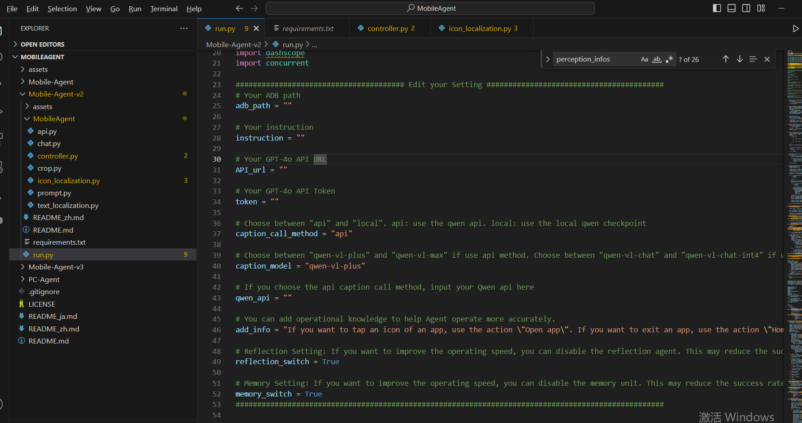
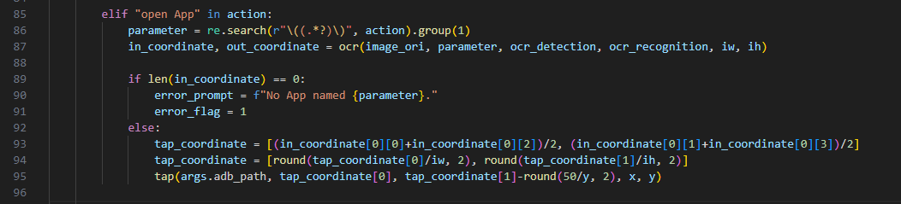
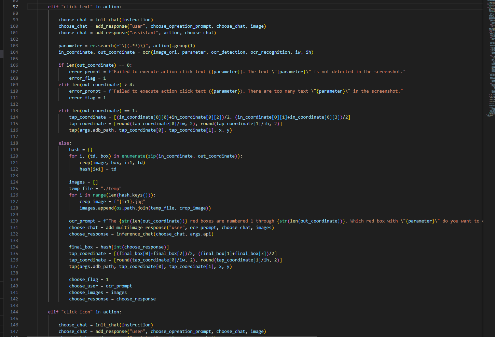
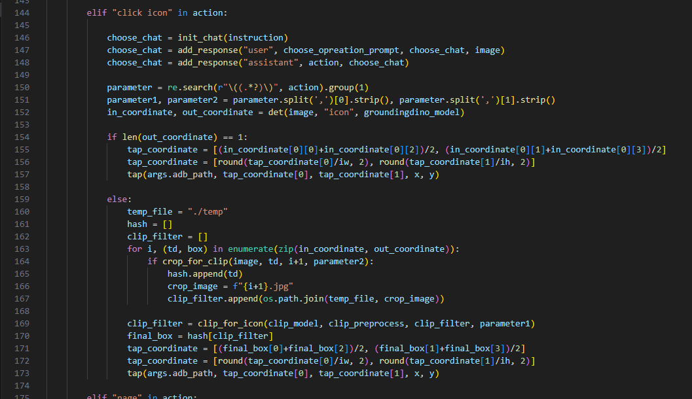
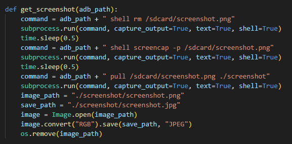
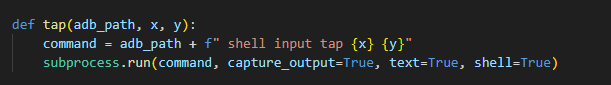
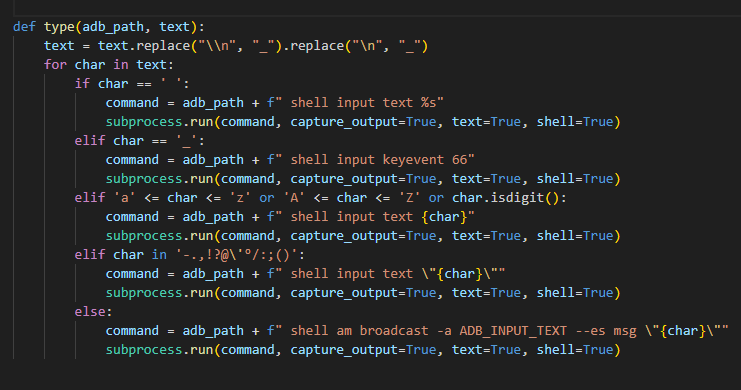
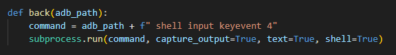

项目地址： [X-PLUG/MobileAgent: Mobile-Agent: The Powerful Mobile Device Operation Assistant Family (github.com)](https://github.com/X-PLUG/MobileAgent/tree/main)

项目解析视频： https://www.bilibili.com/video/BV1Eoh9epEws/?spm_id_from=333.337.search-card.all.click&vd_source=4d61f6680846bfba0322cfca7beca358

# 项目解析

## 一、MobileAgent 功能

能力：MobileAgent 通过截图分析实现移动应用操作智能化。

案例：打开YouTube, 搜索欧文的视频，先点赞，然后发布夸赞评论；

应用方向：

- 移动应用操作：Mobile-Agent可以用于执行各种移动应用中的操作，如浏览网页、搜索信息、发送邮件等。
- 多应用交互：代理能够处理涉及多个应用的复杂任务，如在不同应用间传递信息或执行连续操作。
- 自动化测试：在软件开发中，Mobile-Agent可以用于自动化测试移动应用，提高测试效率和准确性。
- 辅助功能：对于视力障碍或行动不便的用户，Mobile-Agent可以提供辅助操作，帮助他们更便捷地使用移动设备。
- 语言无关操作：由于代理基于视觉感知，它能够支持多语言操作，为全球用户提供服务。

主要缺点：

- 需要的环境复杂
- 贵：需要gpt模型，gpt api 按照token收费。官网采用 GPT-4V(英文+图片)，中文不友好，自己找gpt也不友好。
- 技术栈难度高：

1. 多模态大模型(MLLM GPT-4V)
2. OCR模型(for text localization)
3. Object Detection+CLIP模型(for icon localization)

## 二、相关解析文章

源码解析：[Mobile-Agent项目部署与学习总结（DataWhale AI夏令营）_mobileagent-CSDN博客](https://blog.csdn.net/qq_45590504/article/details/141427681)

项目简介：

[Mobile-Agent：通过截图分析实现移动应用操作自动化 | AI-SCHOLAR | AI：（人工智能）文章和技术信息媒体](https://ai-scholar.tech/zh/articles/pattern-recognition/mobile-agent)

[Mobile-Agent解析 - RainPot Blog](https://rainpot.github.io/blog/mobile-agent解析/#一简介)

## 三、源码解析

针对Mobile-Agent-V2分析：

### 1.相关参数配置

参考文件目录：...\MobileAgent\Mobile-Agent-v2\run.py

重点需要：

- adb的环境
- GPT的API
- 申请阿里的qwen的key

### 2.主要实现流程

参考文件目录：...\MobileAgent\Mobile-Agent\run.py

这个文件的结构更清晰，针对V2版本，源码实现也大致相同；

#### 2.1主要流程

这里省略了具体的实现方式，相关方法请自行下载源码分析；
git bush： git clone https://github.com/X-PLUG/MobileAgent.git

逻辑中主要划分了以下板块：

- 停止：指令完成后，整个进程终止。

- 打开应用程序（App）：打开桌面页面上的特定应用程序。
- 点击文本（Text）：点击屏幕上标有 "文本 "的区域。
- 点击图标（图标，位置）： 点击 "图标 "描述的 "位置 "区域。
  图标 "提供了对点击位置的描述，包括其属性（颜色、图标形状等）。
  位置 "可从顶部、底部、左侧、右侧或中央选择一个或两个选项，以减少出错的可能性。
- 上下翻页：上下滚动当前页面。
- 类型（文本）：在当前输入框中输入 "文本"。
- 返回：回到最后一页。
- 退出：从当前页面直接返回桌面。

#### 2.2 open App

#### 2.3 click Text

#### 2.4 click Icon

### 3. 实现方式

参考文件目录：...\MobileAgent\Mobile-Agent-v2\MobileAgent\controller.py

#### 3.1 获取屏幕截屏

#### 3.2 点坐标(x,y)

#### 3.3 type 模拟文本输入

#### 3.4 滑动

#### 3.5 返回

#### 3.6 退出

